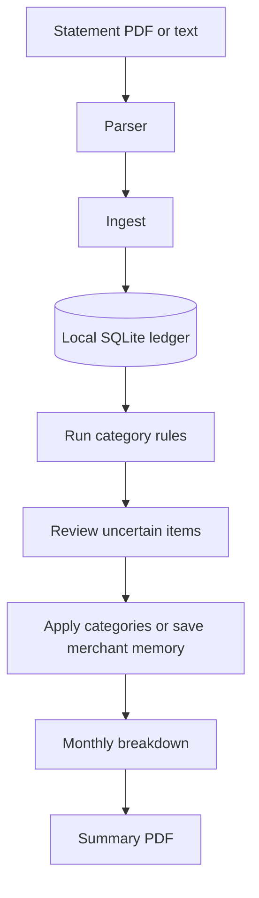

# Canhoto

Canhoto keeps your bank and card statement data on your computer. It helps you
parse statements, categorize spending, review uncertain items, and export a
monthly PDF.

> **Using an AI agent?** Connect `canhoto-mcp`. It gives the agent a safe,
> bounded workflow for parsing statements, reviewing and categorizing expenses,
> viewing monthly totals, and exporting reports. It never gives the agent SQL
> access or a full ledger dump. Use the CLI for the same workflow by hand.

| | |
|---|---|
| Package | `canhoto` |
| CLI | `canhoto` |
| MCP | `canhoto-mcp` |
| Data | `~/.canhoto` or `$CANHOTO_DATA_DIR` |

## Install

Install a release:

```bash
uv tool install canhoto
```

Or run this repository locally:

```bash
uv sync
uv run canhoto --help
```

Create the local data directory:

```bash
canhoto init
canhoto doctor
```

## How it works



Parsers only extract statement rows. Canhoto core handles categories, merchant
memory, reports, and exports.

## Create a parser

Canhoto does not ship bank-specific parsers. Create one for your statement:

```bash
canhoto parsers scaffold --id my_bank_card --type card --institution my_bank
```

Edit `~/.canhoto/parsers/my_bank_card.py`, then test and enable it:

```bash
canhoto parsers test --id my_bank_card --file ~/statements/sample.pdf
canhoto parsers enable --id my_bank_card
```

A parser must successfully extract transactions before it can be enabled. See
[`examples/parsers/`](examples/parsers/) for a small example.

## Process a month

```bash
# Ingest statements.
canhoto ingest ~/statements/*.pdf

# Apply category rules and remembered merchant categories.
canhoto categorize rules --month 2026-06

# Review anything still uncertain.
canhoto review --month 2026-06 --json

# See income, expenses, and category totals.
canhoto breakdown --month 2026-06

# Create a local PDF report.
canhoto export pdf 2026-06
```

To remember a category for later matching merchants:

```bash
canhoto categorize merchant --key CURSOR --category Subscriptions
```

The PDF is written to `~/.canhoto/exports/2026-06-summary.pdf` by default.
It shows totals by category and top normalized merchants within each category.
It never contains a full transaction table or raw statement descriptions.

### PDF profiles

Choose a built-in style:

```bash
canhoto export pdf 2026-06 --profile canhoto
canhoto export pdf 2026-06 --profile modern --output ~/Documents/2026-06.pdf
canhoto export pdf 2026-06 --profile minimal
```

- `canhoto` - receipt-style report with a category chart.
- `modern` - clean report with metric cards and a category chart.
- `minimal` - text-only report without a chart.

## MCP

The CLI and MCP server use the same service layer. For agent-assisted use,
start the MCP server and follow this flow:

`statement_preview` -> `parser_*` -> `ingest` -> `run_rules` ->
`review_batch` -> `set_categories` -> `month_breakdown` -> `export_pdf`

MCP only exposes domain tools. It does not provide SQL access or full ledger
dumps. To let an agent write parsers, add this to `~/.canhoto/config.json`:

```json
{ "agent_view": { "allow_parser_writes": true } }
```

Example MCP host configuration:

```yaml
mcp_servers:
  canhoto:
    command: canhoto-mcp
```

## CLI commands

```text
canhoto init | doctor
canhoto parsers scaffold|test|enable|list
canhoto ingest <files...>
canhoto categorize rules --month YYYY-MM
canhoto categorize apply --file patches.json
canhoto categorize merchant --key KEY --category CAT
canhoto review --month YYYY-MM [--cursor] [--limit]
canhoto breakdown --month YYYY-MM
canhoto export pdf YYYY-MM [--profile canhoto|modern|minimal] [--output PATH]
```

## Develop

```bash
uv sync --extra dev
uv run pytest -q
uv run ruff check src/canhoto tests
uv run mypy -p canhoto
```

Or use [`justfile`](justfile) with [Just](https://just.systems/).

## Privacy

Your statements and database stay in the data directory. Do not commit
statements, tokens, database files, or `~/.canhoto`.
