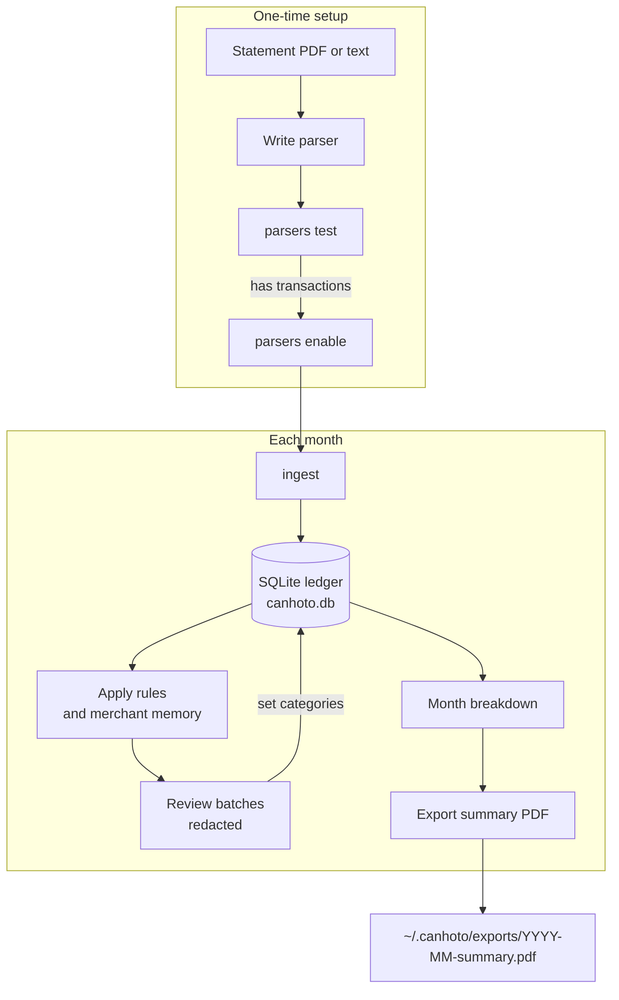

# Canhoto

Canhoto keeps a local copy of your bank and card statement data.

You install a CLI. You can also run an MCP server for agents.

You write Python parsers for your statements. Canhoto stores the data in SQLite. You categorize the transactions. You export a monthly summary PDF.

| | |
|---|---|
| Package | `canhoto` |
| CLI | `canhoto` |
| MCP | `canhoto-mcp` |
| Data | `~/.canhoto` or `$CANHOTO_DATA_DIR` |

## Install

Install from a release:

```bash
uv tool install canhoto
```

Or install from this repository:

```bash
uv sync
uv run canhoto --help
```

Create the data directory and config:

```bash
canhoto init
canhoto doctor
```

### MCP host

Add the MCP server to your host config (for example Hermes):

```yaml
mcp_servers:
  canhoto:
    command: canhoto-mcp
```

To let an agent write parsers, set this in `~/.canhoto/config.json`:

```json
{ "agent_view": { "allow_parser_writes": true } }
```

## Workflow



The CLI and the MCP server use the same service layer.

Agent tools follow this order: `statement_preview`, `parser_*`, `ingest`, `run_rules`, `review_batch`, `set_categories`, `month_breakdown`, `export_pdf`.

### Create a parser

Scaffold a parser module:

```bash
canhoto parsers scaffold --id my_bank_card --type card --institution my_bank
```

Edit `~/.canhoto/parsers/my_bank_card.py`. Implement `register()`.

Test the parser on a sample file:

```bash
canhoto parsers test --id my_bank_card --file ~/statements/sample.pdf
```

Enable the parser only after a successful test:

```bash
canhoto parsers enable --id my_bank_card
```

A demo parser is in [`examples/parsers/`](examples/parsers/). The package does not load it.

### Process a month

Ingest statement files:

```bash
canhoto ingest ~/statements/*.pdf
```

Apply category rules:

```bash
canhoto categorize rules --month 2026-06
```

Review pending items (JSON output):

```bash
canhoto review --month 2026-06 --json
```

Show the month breakdown:

```bash
canhoto breakdown --month 2026-06
```

Export the summary PDF:

```bash
canhoto export pdf 2026-06
```

The file is written to `~/.canhoto/exports/2026-06-summary.pdf`.

## Design

**Parsers.** You keep parser plugins in the data directory. The package does not ship bank parsers.

**Ledger.** SQLite file `canhoto.db` is the system of record.

**MCP.** Agents get domain tools only. They do not get raw SQL or a full ledger dump.

**Guardrails.** Review batches are redacted. A month filter is required. Batch size is limited. The PDF is a summary. It does not list every transaction.

**Core.** The core does not bind to one country. Set currency and locale in config.

## CLI commands

```text
canhoto init | doctor
canhoto parsers scaffold|test|enable|list
canhoto ingest <files...>
canhoto categorize rules --month YYYY-MM
canhoto categorize apply --file patches.json
canhoto categorize merchant --key KEY --category CAT
canhoto review --month YYYY-MM [--cursor] [--limit]
canhoto breakdown --month YYYY-MM
canhoto export pdf YYYY-MM
```

Use `parsers test` before you enable a parser. There is no separate `parse` command.

MCP agents use `statement_preview` for statement text. They do not receive full ledger dumps.

## Develop

Install development dependencies:

```bash
uv sync --extra dev
```

Run checks:

```bash
uv run pytest -q
uv run ruff check src/canhoto tests
uv run mypy -p canhoto
```

Or use the recipes in [`justfile`](justfile) if you have [Just](https://just.systems/) installed.

Agent notes: [`AGENTS.md`](AGENTS.md).

## Privacy

Keep money data in your data directory.

Do not commit statements, tokens, or `~/.canhoto`.
