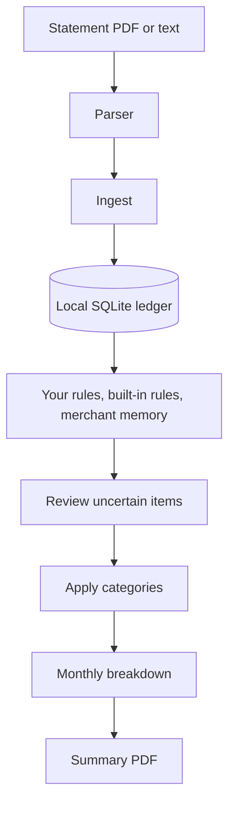

# Canhoto

Canhoto keeps your bank and card statements on your computer. It parses
statements, categorizes spending, asks you about uncertain items, and exports a
monthly PDF summary.

> **Using an AI agent?** Connect `canhoto-mcp`. The agent gets a bounded set of
> tools to parse statements, review and categorize transactions, read monthly
> totals, and export reports. It never gets SQL access or a full ledger dump.
> The CLI gives you the same workflow by hand.

| | |
|---|---|
| Package | `canhoto` |
| CLI | `canhoto` |
| MCP | `canhoto-mcp` |
| Data | `~/.canhoto` or `$CANHOTO_DATA_DIR` |

## Install

Install the CLI and the MCP server from PyPI:

```bash
uv tool install canhoto
```

Or install from a checkout of this repository:

```bash
uv tool install .
```

Or run it in place:

```bash
uv sync
uv run canhoto --help
```

Then create the data directory and check it:

```bash
canhoto init
canhoto doctor
```

## How it works


```mermaid
flowchart TD
  A[Statement PDF or text] --> B[Parser]
  B --> C[Ingest]
  C --> D[(Local SQLite ledger)]
  D --> E[Your rules, built-in rules, merchant memory]
  E --> F[Review uncertain items]
  F --> G[Apply categories]
  G --> H[Monthly breakdown]
  H --> I[Summary PDF]
```

Parsers only read statement rows. Canhoto handles categories, rules, merchant
memory, reports, and exports.

## Create a parser

Canhoto does not ship bank-specific parsers. Create one for your statement:

```bash
canhoto parsers scaffold --id my_bank_card --type card --institution my_bank
```

Edit `~/.canhoto/parsers/my_bank_card.py`, then test and enable it:

```bash
canhoto parsers test --id my_bank_card --file ~/statements/sample.pdf
canhoto parsers enable --id my_bank_card
```

You can enable a parser only after a test extracts at least one transaction.
A failed test disables the parser until it passes again. See
[`examples/parsers/`](examples/parsers/) for a small example.

For password-protected PDFs, pass `--pdf-password` or set
`CANHOTO_PDF_PASSWORD`.

## Process a month

```bash
# Read statements into the ledger.
canhoto ingest ~/statements/*.pdf

# Apply your rules, the built-in rules, and merchant memory.
canhoto categorize rules --month 2026-06

# List the items that still need a decision.
canhoto review --month 2026-06

# Apply your decisions.
canhoto categorize apply --file patches.json

# See income, expenses, and category totals.
canhoto breakdown --month 2026-06

# Write the PDF summary.
canhoto export pdf 2026-06
```

`patches.json` is a list of changes, one per transaction id from `review`:

```json
[
  { "id": "my_bank_card-2026-06-02-0001", "category": "Groceries",
    "kind": "expense", "is_expense": true, "needs_review": false }
]
```

Canhoto marks every row you change this way as `manual`. No automatic rule
changes a manual row again.

The PDF goes to `~/.canhoto/exports/2026-06-summary.pdf` by default. It shows
totals by category and the top merchants in each category. It never contains a
transaction list or raw statement descriptions.

### Teach Canhoto your rules

When a counterparty always means the same thing, store a rule. `categorize
rules` applies it to every future statement.

```bash
canhoto rules add --pattern "PIX RECEBIDO ACME LTDA" --direction in \
  --min 1200 --max 1300 --category Income --kind income \
  --note "Monthly pay from my company"
canhoto rules list
canhoto rules remove --id 3
```

| Option | Meaning |
|---|---|
| `--pattern` | Regular expression, case-insensitive, matched against the description. |
| `--direction` | `in` (money received), `out` (money sent), or `any`. |
| `--min`, `--max` | Amount range, inclusive, without the sign. Both are optional. |
| `--source-kind` | Match only `account` or `card` rows. |
| `--category` | The category to set. |
| `--kind` | `expense`, `income`, `transfer`, `internal_transfer`, `self_transfer`, or `card_payment`. Transfers do not count as income or spending. |
| `--review` | Set the category, but keep the row in the review queue. Use this when an amount range cannot separate two cases. |
| `--note` | Why the rule exists. Agents read it during review. Do not put secrets in it. |
| `--priority` | Lower numbers run first. The first matching rule wins. |

Your rules run before the built-in rules. They never change manual rows. When
you upgrade to the version with rules, Canhoto marks your existing reviewed
rows as manual.

To remember one merchant without a full rule, use merchant memory:

```bash
canhoto categorize merchant --key CURSOR --category Subscriptions
```

### PDF profiles

Choose a built-in style:

```bash
canhoto export pdf 2026-06 --profile canhoto
canhoto export pdf 2026-06 --profile modern --output ~/Documents/2026-06.pdf
canhoto export pdf 2026-06 --profile minimal
```

- `canhoto`: receipt-style report with a category chart.
- `modern`: clean report with metric cards and a category chart.
- `minimal`: text-only report without a chart.

## MCP

The CLI and the MCP server use the same service layer. For agent-assisted use,
start the MCP server. The agent follows this flow:

`statement_preview` -> `parser_*` -> `ingest` -> `rule_list` -> `run_rules` ->
`review_batch` -> `set_categories` -> `month_breakdown` -> `export_pdf`

When you explain a recurring counterparty to the agent, it can store it with
`rule_add`. The MCP server exposes only domain tools. It does not give SQL
access or full ledger dumps.

To let an agent write parsers, add this to `~/.canhoto/config.json`:

```json
{ "agent_view": { "allow_parser_writes": true } }
```

Example MCP host configuration:

```yaml
mcp_servers:
  canhoto:
    command: canhoto-mcp
```

## CLI commands

```text
canhoto init | doctor
canhoto parsers scaffold|test|enable|list
canhoto ingest <files...> [--pdf-password PASSWORD]
canhoto categorize rules --month YYYY-MM
canhoto categorize apply --file patches.json
canhoto categorize merchant --key KEY --category CAT
canhoto rules add|list|remove
canhoto review --month YYYY-MM [--cursor ID] [--limit N]
canhoto breakdown --month YYYY-MM
canhoto export pdf YYYY-MM [--profile canhoto|modern|minimal] [--output PATH]
```

## Develop

```bash
uv sync --extra dev
uv run pytest -q
uv run ruff check src/canhoto tests
uv run mypy -p canhoto
```

Or use the [`justfile`](justfile) with [Just](https://just.systems/).

### Release

Pushing a version tag publishes to PyPI through
[`.github/workflows/release.yml`](.github/workflows/release.yml). The workflow
tests, builds, smoke-tests the wheel and the source distribution, and publishes
with PyPI Trusted Publishing. The tag must match the version in
`pyproject.toml`.

```bash
uv version --bump patch   # or minor / major
git commit -am "chore: release v$(uv version --short)"
git tag -a "v$(uv version --short)" -m "v$(uv version --short)"
git push origin main --tags
```

## Privacy

Your statements and database stay in the data directory. Do not commit
statements, tokens, database files, or `~/.canhoto`. Back up `canhoto.db` before
you upgrade: it holds your ledger and your rules.
