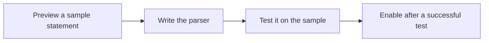
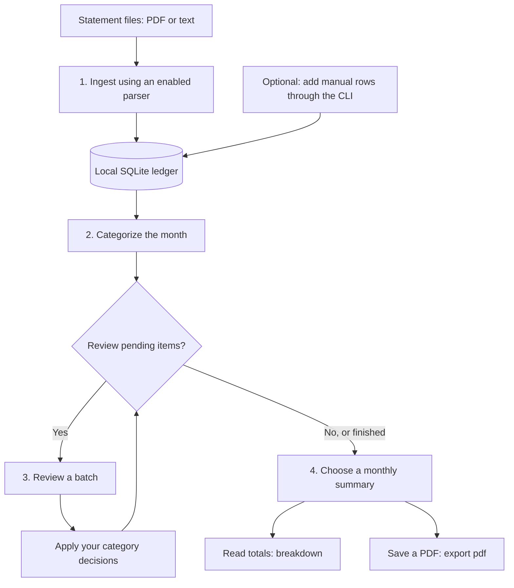

# Canhoto

Canhoto keeps your bank and card statements on your computer. It parses
statements, categorizes spending, asks you about uncertain items, and exports a
monthly PDF summary.

> **Using an AI agent?** Connect `canhoto-mcp`. The agent gets a bounded set of
> tools to parse statements, review and categorize transactions, read monthly
> totals, and export reports. It never gets SQL access or a full ledger dump.
> The CLI gives you the same workflow by hand.

| | |
|---|---|
| Package | `canhoto` |
| CLI | `canhoto` |
| MCP | `canhoto-mcp` |
| Data | `~/.canhoto` or `$CANHOTO_DATA_DIR` |

## Install

Install the CLI and the MCP server from PyPI:

```bash
uv tool install canhoto
```

Or install from a checkout of this repository:

```bash
uv tool install .
```

Or run it in place:

```bash
uv sync
uv run canhoto --help
```

Then create the data directory and check it:

```bash
canhoto init
canhoto doctor
```

## How it works

### Parser setup

[Create a parser](#create-a-parser) for each statement format. Reuse it each
month; test it again when you change its code.


```mermaid
flowchart LR
  Preview["Preview a sample statement"] --> Write["Write the parser"]
  Write --> Test["Test it on the sample"]
  Test --> Enable["Enable after a successful test"]
```

A parser reads statement text and returns transaction rows. `ingest` extracts
the text and runs an enabled parser. You do not run the parser separately.

### Monthly workflow


```mermaid
flowchart TD
  Files["Statement files: PDF or text"] --> Ingest["1. Ingest using an enabled parser"]
  Ingest --> Ledger[("Local SQLite ledger")]
  Manual["Optional: add manual rows through the CLI"] --> Ledger
  Ledger --> Rules["2. Categorize the month"]
  Rules --> ReviewChoice{"Review pending items?"}
  ReviewChoice -->|Yes| Review["3. Review a batch"]
  Review --> Apply["Apply your category decisions"]
  Apply --> ReviewChoice
  ReviewChoice -->|"No, or finished"| Reports["4. Choose a monthly summary"]
  Reports --> Totals["Read totals: breakdown"]
  Reports --> PDF["Save a PDF: export pdf"]
```

- Ingest, rules, and category decisions update the same local ledger.
- Categorization applies your rules, built-in rules, self-transfer checks, then merchant memory.
- Review returns batches, not the full ledger. Repeat it until you finish your decisions.
- You can request totals or export a PDF without review. Unreviewed expenses can remain uncategorized.
- Breakdown and PDF are separate outputs. Use either one, or both.
- Manual rows join the same reports. They do not require a parser or a statement.

## Currency and country support

Manual entries and parser rows support ISO 4217 currencies with defined decimal
minor units. JPY uses zero decimal places; KWD uses three. Input validation
rejects rounding, non-finite amounts, and integer overflow.

| Part | Current behavior |
|---|---|
| [Parser interface and ledger](src/canhoto/core/models.py) | Each row stores its currency and decimal exponent. Non-two-decimal parser rows must declare the exponent explicitly. |
| [Parser row and review defaults](src/canhoto/core/redaction.py) | BRL is the default when a parser omits currency. Review preserves an explicit currency. |
| [Manual transactions](src/canhoto/core/manual.py) | `--currency` overrides the configured default. Each row stores its currency and includes it in manual output. |
| [Monthly totals](src/canhoto/core/breakdown.py) | Income, expenses, net, and categories are grouped by currency. No total combines currencies. |
| [PDF summaries](src/canhoto/exporters/pdf_summary.py) | Each currency starts its own page. All profiles use explicit codes, such as `JPY 1,250` and `KWD 12.345`. |
| [Automatic categorization](src/canhoto/core/categorize.py) | Built-in matches include Portuguese card-payment, savings, and income terms. Self-transfer checks recognize Pix, TED, and DOC. Merchant cleanup also recognizes Brazilian statement text. |
| [Merchant memory](src/canhoto/core/categorize.py) | Person-ID checks include a CPF-sized digit heuristic. This is not a complete identity detector. |

A ledger can contain multiple currencies. `breakdown` returns money under
`breakdown.by_currency`, even when only one currency exists:

```json
{
  "JPY": {"income": "3000", "expenses": "1250", "net": "1750"},
  "KWD": {"income": "0.000", "expenses": "12.345", "net": "-12.345"}
}
```

These are separate balances, not values to add together. Canhoto does not
fetch exchange rates or convert currencies. Reports refuse months above the
50,000-row limit instead of showing partial totals.

Upgrade preserves existing amounts and running balances as hundredths. It
does not infer a new scale from their currency codes. Legacy fractional JPY
values remain unchanged and appear without rounding. Backup restore preserves
these recorded units too.

## Configuration

Set a user-wide default, or override it for the active ledger:

```bash
canhoto config set --global currency EUR
canhoto config set currency USD
canhoto config get currency
canhoto config get --global currency
canhoto config unset currency
```

- Global settings use `$XDG_CONFIG_HOME/canhoto/config.json`, or `~/.config/canhoto/config.json` when XDG is unset or relative.
- Ledger settings use the existing `config.json` in the active data directory.
- Local means the data directory selected by `CANHOTO_DATA_DIR`, not your current working directory.

For a new manual row, currency precedence is:

1. The explicit `--currency` option.
2. The ledger's currency override.
3. The global currency default.
4. BRL when neither config declares a currency.

`config get currency` returns the effective value as JSON. With `--global`,
it returns only the declared global value, or `null` when none exists. Reads
do not create files or a ledger. `config unset currency` restores global
inheritance. Add `--global` to remove the user-wide default instead.

The only supported key is `currency`. Codes need three ASCII letters and
are normalized to uppercase. New settings must identify an ISO currency with
defined decimal minor units. Currency data comes from the `iso4217` package.

Changing config does not change stored transactions. Ledger backups include
local overrides, but not global preferences. Config management is CLI only.

## Create a parser

Canhoto does not ship bank-specific parsers. A parser is one small Python file
in `~/.canhoto/parsers/`. It reads the text of a statement and returns its rows.
You do not need this repository to write one.

1. Create the parser file:

   ```bash
   canhoto parsers scaffold --id my_bank_card --type card --institution my_bank
   ```

2. See the text the parser receives. This is the extracted text, not the PDF
   layout:

   ```bash
   canhoto parsers preview --file ~/statements/sample.pdf > sample.txt
   ```

3. Edit `~/.canhoto/parsers/my_bank_card.py`. The file already reads rows such
   as `2026-06-02  ACME STORE  -12.34`, and its comments list the rules.
   Change three things:
   - `sniff()`: return a score above 0 only for text unique to this statement.
   - `_ROW` and `parse()`: match the row format you saw in step 2.
   - `_CURRENCY`: your ISO 4217 currency code.

4. Test the parser, then enable it:

   ```bash
   canhoto parsers test --id my_bank_card --file ~/statements/sample.pdf
   canhoto parsers enable --id my_bank_card
   ```

The test passes only when `parse()` returns at least one transaction and
`sniff()` claims the sample. A failed test disables the parser until it passes
again.

Use the shared money helpers. Do not multiply every amount by 100:

```python
from datetime import date
from canhoto.core.models import LedgerTransaction
from canhoto.core.money import currency_exponent, to_minor

currency = "KWD"
tx = LedgerTransaction(
    id="my_bank_card-op0001",
    date=date(2026, 6, 2),
    amount_minor=to_minor("-12.345", currency),
    amount_exponent=currency_exponent(currency),
    currency=currency,
    source_kind="card",
    month="2026-06",
)
```

Non-two-decimal parser rows must declare the exponent explicitly. Existing
non-two-decimal parsers need an update and a new test before use. Retain their
transaction ids when updating units; otherwise re-ingest can create duplicates.

Keep transaction ids stable. Include account and currency when bank operation
ids are not unique across feeds. Never use the row position. Leave `category`
and `kind` empty. Your rules and review set them.

For password-protected PDFs, pass `--pdf-password` or set
`CANHOTO_PDF_PASSWORD`. For a complete example, see
[`examples/parsers/`](https://github.com/luabagg/canhoto/tree/main/examples/parsers).
An agent connected to `canhoto-mcp` can also write the parser for you. See
the MCP section below.

## Process a month

```bash
# Read statements into the ledger.
canhoto ingest ~/statements/*.pdf

# Apply your rules, the built-in rules, and merchant memory.
canhoto categorize rules --month 2026-06

# List the items that still need a decision.
canhoto review --month 2026-06

# Apply your decisions.
canhoto categorize apply --file patches.json

# See income, expenses, and category totals.
canhoto breakdown --month 2026-06

# Write the PDF summary.
canhoto export pdf 2026-06
```

`patches.json` is a list of changes, one per transaction id from `review`:

```json
[
  { "id": "my_bank_card-2026-06-02-0001", "category": "Groceries",
    "kind": "expense", "is_expense": true, "needs_review": false }
]
```

Canhoto marks every row you change this way as `manual`. No automatic rule
changes a manual row again.

The PDF goes to `~/.canhoto/exports/2026-06-summary.pdf` by default. It shows
separate currency totals, category totals, and top merchants in each category.
It never contains a transaction list or raw statement descriptions.

### Keep manual transactions

Some money moves outside every statement you can export, for example a Pix sent
straight from a savings reserve. Keep those rows yourself:

```bash
canhoto manual add --date 2026-09-17 --amount -3080.00 \
  --description "Pix enviado Example Tax Office" --category Taxes --currency BRL \
  --merchant IPVA --account cofrinho --note "Car tax, paid from the reserve"
canhoto manual list [--month 2026-09]
canhoto manual edit --id manual-... --amount -3100.00 --category Taxes
canhoto manual remove --id manual-...
```

A negative amount is money out. With `--category`, the row is set by hand.
Without it, your rules classify the row, or it waits in `review`. Canhoto
refuses to add the same date, currency, amount, description, and account twice.
An edit keeps the id. `edit` and `remove` refuse statement rows: those change
only when you ingest the statement again.

Use `--currency EUR` on add to override the configured default. Add, edit,
and list output include each row's currency. An edit without `--currency`
keeps the stored code, even after config changes. Currency correction preserves
the numeric major-unit amount without FX conversion. It rejects a correction
that would need rounding, such as EUR 12.34 to JPY.

### Teach Canhoto your rules

When a counterparty always means the same thing, store a rule. `categorize
rules` applies it to every future statement.

```bash
canhoto rules add --pattern "PIX RECEBIDO ACME LTDA" --direction in \
  --min 1200 --max 1300 --currency BRL --category Income --kind income \
  --note "Monthly pay from my company"
canhoto rules list
canhoto rules remove --id 3
```

| Option | Meaning |
|---|---|
| `--pattern` | Regular expression, case-insensitive, matched against the description. |
| `--direction` | `in` (money received), `out` (money sent), or `any`. |
| `--min`, `--max` | Amount range, inclusive, without the sign. Both use the rule's recorded currency and precision. |
| `--currency` | Match only this currency. Bounded rules capture the configured currency when omitted. Unbounded rules without currency can match all currencies. |
| `--source-kind` | Match only `account` or `card` rows. |
| `--category` | The category to set. |
| `--kind` | `expense`, `income`, `transfer`, `internal_transfer`, `self_transfer`, or `card_payment`. Transfers do not count as income or spending. |
| `--review` | Set the category, but keep the row in the review queue. Use this when an amount range cannot separate two cases. |
| `--note` | Why the rule exists. Agents read it during review. Do not put secrets in it. |
| `--priority` | Lower numbers run first. The first matching rule wins. |

Your rules run before the built-in rules. They never change manual rows. When
you upgrade to the version with rules, Canhoto marks your existing reviewed
rows as manual.

Legacy amount-bounded rules have no recorded currency. `rules list` shows
`currency: null` for these rules. Remove and recreate them with an explicit
`--currency` before running rules. Canhoto preserves their amounts and notes;
it does not guess their denomination.

To remember one merchant without a full rule, use merchant memory:

```bash
canhoto categorize merchant --key CURSOR --category Subscriptions
```

### PDF profiles

Choose a built-in style:

```bash
canhoto export pdf 2026-06 --profile canhoto
canhoto export pdf 2026-06 --profile modern --output ~/Documents/2026-06.pdf
canhoto export pdf 2026-06 --profile minimal
```

- `canhoto`: receipt-style report with a category chart.
- `modern`: metric cards and a category chart. Very long amounts use full-width metric rows.
- `minimal`: text-only report without a chart.

## Back up and restore

Write your ledger, rules, merchant memory, config, and parsers to one file:

```bash
canhoto backup                        # ./canhoto-YYYY-MM-DD.canhoto
canhoto backup --output ~/backups/home.canhoto
```

Restore it into a new or empty data directory. Do not run `canhoto init` there first:

```bash
CANHOTO_DATA_DIR=~/.canhoto-new canhoto restore ~/backups/home.canhoto
```

A `.canhoto` file is a zip archive. Open it with any unzip tool:

| File | Content |
|---|---|
| `manifest.json` | Format version, Canhoto version, schema revision, row counts, SHA-256 of each file |
| `canhoto.sql` | Plain SQL dump of `canhoto.db`: schema and rows. `sqlite3 new.db < canhoto.sql` rebuilds it. |
| `config.json` | Settings and the parser registry |
| `parsers/*.py` | Your parser modules |

The backup does not include raw statements. A restored ledger cannot re-parse
old statements until you ingest them again.

Restore checks every checksum and the schema revision before it writes. It
prepares and migrates the ledger in a private temporary directory. It installs
the full restore only after all files are ready. A failed restore permits a
retry. Restore refuses non-empty directories and directory links. It keeps
parser modules in the restored directory's `parsers/` folder, even when the
backup used a custom parser location.

Restore only backups you trust. Checksums do not authenticate the sender. The
backup includes executable parser modules and holds your full ledger in plain
text, so keep the file private. `backup` and `restore` are CLI only: the MCP
server never gives an agent a full ledger dump.

## MCP

The CLI and the MCP server use the same service layer. For agent-assisted use,
start the MCP server. The agent follows this flow:

`statement_preview` -> `parser_*` -> `ingest` -> `rule_list` -> `run_rules` ->
`review_batch` -> `set_categories` -> `month_breakdown` -> `export_pdf`

When you explain a recurring counterparty to the agent, it can store it with
`rule_add`. The MCP server exposes only domain tools. It does not give SQL
access or full ledger dumps.

To let an agent write parsers, add this to `~/.canhoto/config.json`:

```json
{ "agent_view": { "allow_parser_writes": true } }
```

Example MCP host configuration:

```yaml
mcp_servers:
  canhoto:
    command: canhoto-mcp
```

## CLI commands

```text
canhoto init | doctor
canhoto config get|unset [--global] currency
canhoto config set [--global] currency CODE
canhoto parsers scaffold|preview|test|enable|list
canhoto ingest <files...> [--pdf-password PASSWORD]
canhoto categorize rules --month YYYY-MM
canhoto categorize apply --file patches.json
canhoto categorize merchant --key KEY --category CAT
canhoto rules add|list|remove
canhoto review --month YYYY-MM [--cursor ID] [--limit N]
canhoto breakdown --month YYYY-MM
canhoto export pdf YYYY-MM [--profile canhoto|modern|minimal] [--output PATH]
canhoto manual add --date YYYY-MM-DD --amount SIGNED --description TEXT [--currency CODE] [--category CAT]
canhoto manual list [--month YYYY-MM] | edit --id ID [fields] | remove --id ID
canhoto backup [--output PATH]
canhoto restore PATH
```

## Develop

```bash
uv sync --extra dev
uv run pytest -q
uv run ruff check src/canhoto tests
uv run mypy -p canhoto
```

Or use the [`justfile`](https://github.com/luabagg/canhoto/blob/main/justfile) with [Just](https://just.systems/).

### Release

Pushing a version tag publishes to PyPI through
[`.github/workflows/release.yml`](https://github.com/luabagg/canhoto/blob/main/.github/workflows/release.yml). The workflow
tests, builds, smoke-tests the wheel and the source distribution, and publishes
with PyPI Trusted Publishing. The tag must match the version in
`pyproject.toml`.

```bash
uv version --bump patch   # or minor / major
git commit -am "chore: release v$(uv version --short)"
git tag -a "v$(uv version --short)" -m "v$(uv version --short)"
git push origin main --tags
```

## Privacy

Your statements and database stay in the data directory. Do not commit
statements, tokens, database files, backups, or `~/.canhoto`. Run
`canhoto backup` before you upgrade: the database holds your ledger and your
rules.
